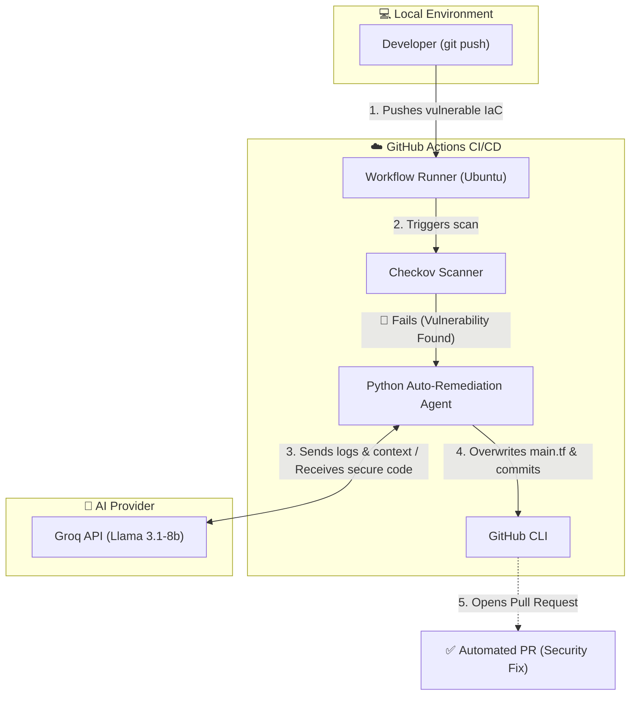

# Autonomous Cloud SecOps Pipeline ☁️🤖

## 👨‍💻 About The Project & Context

I am a Cybersecurity student passionate about cloud security, DevSecOps, and automation, aiming to build a professional career in this field.

This repository was created as a self-study practical project to sharpen my hands-on skills in Infrastructure as Code (IaC) security, Shift-Left methodologies, and integrating Artificial Intelligence into CI/CD pipelines.

---

## 📌 Overview

This project demonstrates a **Zero-Touch Auto-Remediation Pipeline**. It shifts cloud security entirely to the left by automatically detecting misconfigurations in Terraform code and utilizing a Large Language Model (LLM) to write and submit secure patches before the infrastructure is ever deployed.

The lab includes:
* **Vulnerable Infrastructure as Code (Terraform for Azure)**
* **Automated CI/CD security scanning (GitHub Actions + Checkov)**
* **Custom AI SecOps Agent (Python + Groq API / Llama 3.1)**
* **Automated Git operations and Pull Request generation**

---

## 🏗️ Architecture



---

## ⚙️ Core Components

| Component | Role | Technology Stack |
| :--- | :--- | :--- |
| **Infrastructure** | Defines the Azure cloud resources (vulnerable by default for testing). | `Terraform` (HCL), `Azure` |
| **Scanner** | Static Code Analysis (SAST) tool evaluating IaC against compliance policies. | `Checkov` |
| **AI Agent** | Custom script that parses Checkov logs and prompts the LLM for a secure configuration. | `Python`, `Groq API` (Llama 3) |
| **Orchestrator** | Automates the workflow, branch creation, and Pull Request submission. | `GitHub Actions`, `GitHub CLI` |

---

## 🚀 Features Implemented

### 🛡️ Shift-Left Security Validation
* Automated execution of Checkov on every `git push`.
* Intentional pipeline blocking (`soft_fail: false`) to prevent misconfigured Azure resources (e.g., public Storage Accounts) from reaching production.

### 🧠 AI-Driven Auto-Remediation
* Dynamic parsing of JSON vulnerability reports.
* Prompt engineering tailored for strict HCL code generation without markdown hallucinations.
* Sub-second AI inference utilizing the Groq API.

### 🔄 Zero-Touch Automation
* The pipeline automatically sets up Git configuration.
* Generates a unique branch based on the workflow run ID.
* Commits the AI-patched code and uses the `gh` CLI to open a detailed Pull Request for human review.

---

## 🎯 Simulated Vulnerability Scenario

### 1️⃣ Cloud Misconfiguration: Exposed Storage

**Technique:** Deploying an Azure Storage Account with public network access and nested items enabled.

**Observed Checkov Alerts:**
* `CKV_AZURE_190` - Ensure that Storage blobs restrict public access.
* `CKV_AZURE_59` - Ensure that Storage accounts disallow public access.

**Detection & Remediation Outcome:**
* Pipeline halts immediately (Status: **Failed**).
* AI Agent reads the failing policies and rewrites `main.tf`, forcing `public_network_access_enabled = false`.
* A Pull Request is generated within 15 seconds containing the secure configuration.

---

## 🖥️ Example Automated Pull Request

```text
Title: 🚨 Security Fix: Automated IaC Remediation
Author: AI Security Agent (ai-agent@secops.local)
Branch: auto-remediation-31588558959

Body:
Checkov detected security vulnerabilities in Terraform code. 
This PR contains AI-generated fixes to secure the infrastructure.

Files changed:
  main.tf  +58 insertions, -2 deletions
```

---

## 📂 Repository Structure

```text
Autonomous-Cloud-SecOps/
├── .github/
│   └── workflows/
│       └── security-scan.yml   # CI/CD Pipeline configuration
├── .gitignore                  # Protection against state & secret leaks
├── main.tf                     # Vulnerable Azure infrastructure definition
├── providers.tf                # Terraform AzureRM provider setup
├── remediate.py                # AI Auto-Remediation Agent (Python)
├── requirements.txt            # Python dependencies (Groq, dotenv)
└── README.md
```

---

## 📚 Learning Outcomes

Through this project I gained hands-on experience with:
* Implementing the **Shift-Left** security paradigm in modern CI/CD.
* Writing modular **Terraform** code for Azure.
* Integrating and prompting **Large Language Models (LLMs)** via API for programmatic tasks.
* Managing CI/CD secrets and permissions in **GitHub Actions**.
* Understanding the concept of **Human-in-the-Loop**, recognizing that AI can over-provision infrastructure and requires manual PR validation.

---

## 🔮 Future Improvements (Roadmap)

This framework is built for continuous expansion. Planned upcoming features:

* **Remote State Management:** Migrate local Terraform state to a secure, encrypted Azure Blob Storage backend with state locking enabled.
* **Pre-Commit Hooks:** Integrate local Checkov and `terraform fmt` execution via `pre-commit` to catch misconfigurations before they even reach the GitHub repository.
* **Policy-as-Code Customization:** Develop custom Checkov (Python/YAML) or Open Policy Agent (OPA) policies tailored to specific organizational security standards.
* **Infrastructure Drift Detection:** Implement a scheduled GitHub Actions workflow running `terraform plan` to detect and alert on any out-of-band manual changes made directly in the Azure Portal.
* **Container & AKS Security:** Expand the pipeline to scan Dockerfiles and Kubernetes manifests using Trivy, alongside the existing Terraform Azure resources.

---

## 👤 Author

**Mateusz Bennek**
* 🎓 Cybersecurity Master's Student
* ☁️ DevSecOps & Cloud Security Enthusiast
* 🛡️ Interested in **Infrastructure as Code, Python Automation, Active Directory, and AI integration**